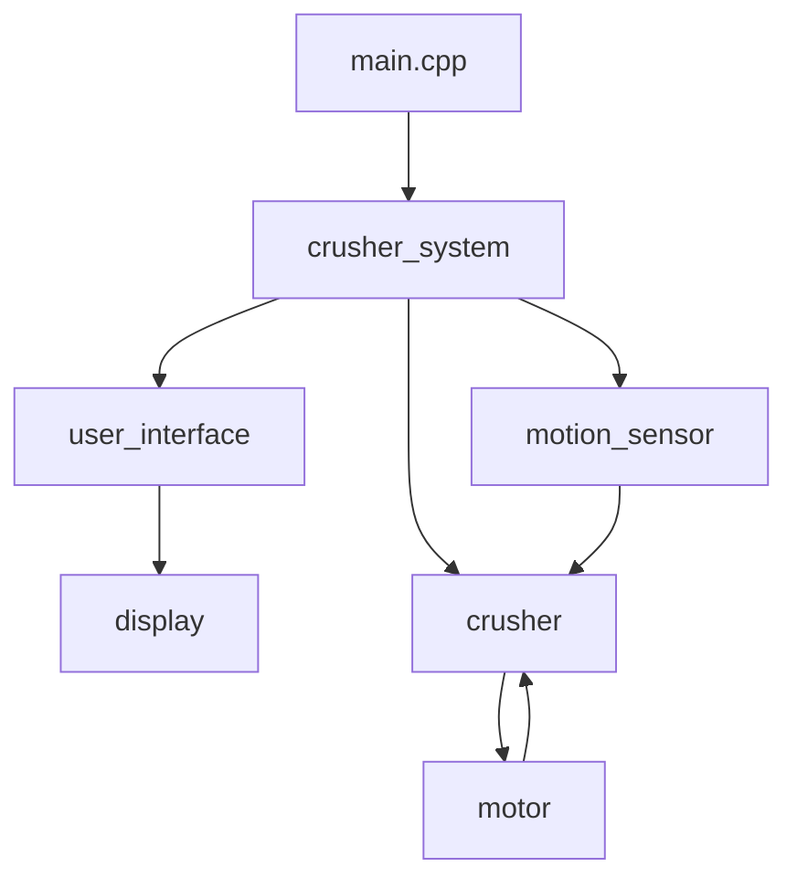

# Can Crusher  
Adam Otsuka & Leo Pratt-Thomas

We built an automated Can Crusher designed to reduce the size of aluminum cans to make Union more sustainable. 

The device uses mechanical and electronic components to crush cans while ensuring safety and ease of use. The system detects when a can is present in the machine, starts via push button when ready, and updates on its status (ready state and how many cans crushed) on the LCD screen. It has an emergency stop as well in case anything goes wrong.

To initiate crushing . Once the crushing process is complete, the user can remove the compressed can from the designated output area.  

The system includes a 24V wormgear motor to provide the crushing force, sensors to detect can placement, and an LCD display to provide real-time feedback on the machine.

## Module Diagram:  

## Project Behavior Table

| Specification  | Test Result  | 
|-----------|-----------|
| LCD updates on can detection | pass |
| Motor activates when start button pressed with can present | pass |
| System remains idle when start button pressed without can | pass |
| Motor stops and count is updated on LCD when motor reaches limit switch | pass |
| Motor stops, LCD, and system stops is updated when Emergency Stop pressed | pass |
