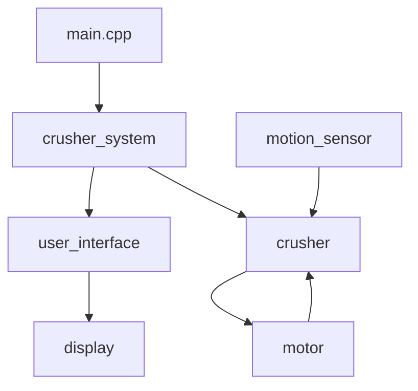

# Can Crusher  
Adam Otsuka & Leo Pratt-Thomas

We built an automated Can Crusher designed to reduce the size of aluminum cans recycling bins making campus more sustainable. 

The device combines mechanical and electronic components to crush cans while prioritizing safety and ease of use. The system detects when a can is present in the machine, starts via push button when ready, and updates on its status (ready state and how many cans crushed) on the LCD screen. It has an emergency stop as well in case anything goes wrong.

The system includes a 24V wormgear motor to provide the crushing force, sensors to detect can placement, and an LCD display to provide real-time feedback on the machine.

To initiate crushing, a button is pressed while the LCD screen reads **"Can Crusher: READY"**. If it is not ready, it will read **"Can Crusher: NOT RDY"**. Once the button is pressed, the display will show **"Can Crusher: BUSY"** and further start button presses will not do anything. During operation, the motor will begin to rotate a four-bar mechanism that puts out enough force to crush the can. When the mechanism hits a limit switch, it will stop. It can also be stopped via emergency stop which will display **"EMERGENCY STOP"** and stop the machine from running. After each operation, the can drops through a slit in the bottom of the machine into a recycling bin and a counter on the LCD will display **"Cans Crushed: [number of cans crushed]"**.  

## Module Diagram:  

## Project Behavior Table

| Specification  | Test Result  | 
|-----------|-----------|
| LCD updates on can detection | pass |
| Motor activates when start button pressed with can present | pass |
| System remains idle when start button pressed without can | pass |
| Motor stops and count is updated on LCD when motor reaches limit switch | pass |
| Motor stops, LCD, and system stops is updated when Emergency Stop pressed | pass |
| When the start button is pressed during operation, it will not stop | pass | 
